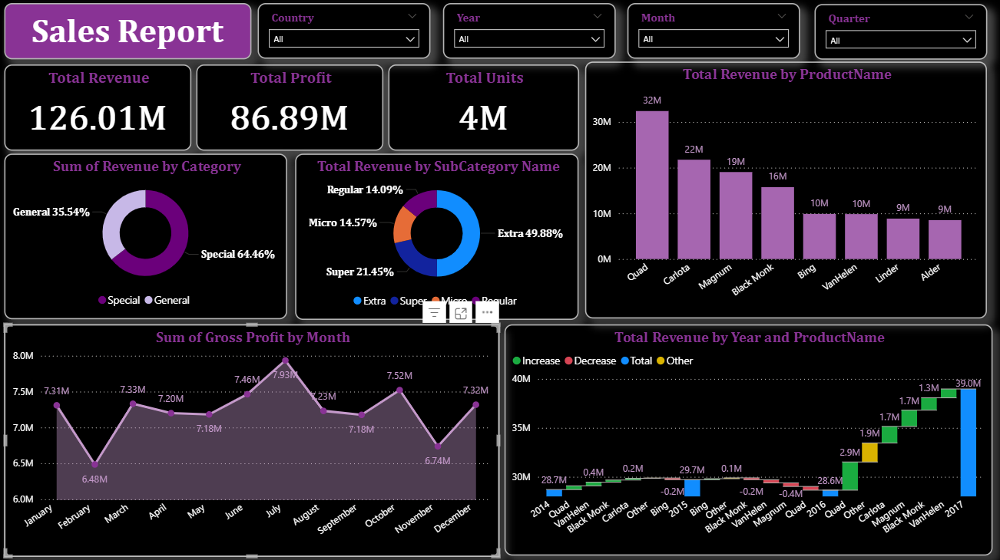

# 📊 Sales Report Dashboard – Power BI

## 🔍 Project Overview
This project presents an end-to-end Sales Analytics Dashboard built using Power BI. It provides insights into revenue, profit, product performance, and sales trends across different dimensions such as time, category, and geography.

The project demonstrates the complete data workflow:
- Data Cleaning
- Data Transformation
- Data Modeling (Star Schema)
- DAX Measures Creation
- Interactive Dashboard Development

## 🚀 Key Features
- Total Revenue: 126.01M
- Total Profit: 86.89M
- Total Units Sold: 4M
- Dynamic Filters: Country, Year, Month, Quarter
- Category & Subcategory Analysis
- Product-wise Revenue Comparison
- Monthly Profit Trends
- Year-wise Revenue Analysis (Waterfall Chart)

## 🛠️ Tools & Technologies
- Power BI
- DAX (Data Analysis Expressions)
- Power Query
- Excel / CSV Dataset

## 🧹 Data Preparation
- Handled missing values and nulls
- Cleaned inconsistent formats
- Standardized categorical fields
- Created calculated columns

## 🧠 Data Modeling
- Built relationships between multiple tables
- Designed a Star Schema model
- Optimized data structure for performance

## 📐 DAX Measures
Some key measures created:
- Total Revenue
- Total Profit
- Total Units
- Profit Margin
- Monthly Gross Profit
- Yearly Growth

## 📊 Key Insights
- Special category contributes ~64% of total revenue
- Top-performing product: Quad (~32M revenue)
- Highest profit observed in July (~7.93M)
- Consistent growth trend across years

## 📸 Dashboard Preview

## 📂 Project Structure
sales-report-powerbi-dashboard
│-- sales-report.pbix
│-- README.md
│-- sales-dashboard.png
│
└── data
     │-- Categories.xlsx
     │-- Geography.xlsx
     │-- Product.csv
     │-- Sales.csv
     │-- SalesRep.xlsx
     │-- SubCategories.xlsx

## 📌 How to Use
1. Download the .pbix file
2. Open using Power BI Desktop
3. Interact with filters and visuals
4. Explore insights dynamically

## 🎯 Business Value
This dashboard helps:
- Track key business KPIs
- Identify top-performing products
- Analyze sales trends over time
- Support data-driven decision making

## 🙌 Author

Aspiring Data Analyst | Excel | SQL | Power BI  

## ⭐ Support
If you found this project useful, feel free to star the repository and connect with me!
